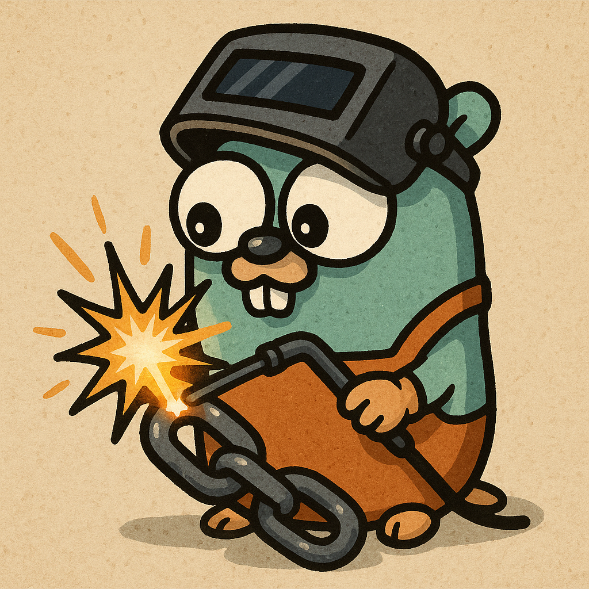

# Welder

<p align="center">
  
</p>

A Go library that simplifies Ethereum smart contract interactions by providing intuitive encoding/decoding between JSON data and Ethereum ABI.

## Overview

Welder bridges the gap between human-readable data formats like JSON and the low-level Application Binary Interface (ABI) required by Ethereum smart contracts. It handles complex nested structures and provides a high-level schema system to define your data, making contract interactions straightforward and type-safe.

## Features

- **High-Level Schema**: Define data structures using a simple, intuitive schema system instead of dealing with low-level ABI types
- **JSON Integration**: "Weld" standard JSON data directly into the format required for smart contract calls
- **Complete ABI Support**: Full support for all Ethereum ABI types including:
  - Integers: `uint8` to `uint256`, `int8` to `int256`
  - Fixed bytes: `bytes1` to `bytes32`
  - Dynamic types: `bytes`, `string`, `address`, `hash`
- **Nested Structures**: Effortlessly handle complex nested objects, arrays, and tuples
- **Data Generation**: Automatically generate example data that conforms to your schema (perfect for testing)
- **Schema Conversion**: Convert between go-ethereum ABI types and Welder's schema format
- **Type Safety**: Ensure data conforms to the required structure before encoding

## Installation

```bash
go get github.com/ideatru/welder
```

## Requirements

- Go 1.24.0 or later
- Ethereum go-ethereum library

## Quick Start

### Basic Usage

```go
package main

import (
    "fmt"
    "github.com/ethereum/go-ethereum/common"
    "github.com/ideatru/welder"
    "github.com/ideatru/welder/types"
)

func main() {
    // Create a new Welder instance
    welder := welder.NewEthereum()

    // Define a schema that matches your contract function parameters
    schema := types.Elements{
        {Type: types.String},                    // First parameter: a string
        {Type: types.Uint, Size: 256},          // Second parameter: a uint256
        {Type: types.Address},                  // Third parameter: an address
    }

    // JSON payload matching the schema
    payload := []byte(`["Hello, Ethereum!", 1000000000000000000, "0xf39Fd6e51aad88F6F4ce6aB8827279cffFb92266"]`)

    // 1. Serialize the schema
    args, err := welder.Serialize(schema)
    if err != nil {
        panic(err)
    }

    // 2. Weld the JSON payload to match the schema
    params, err := welder.Weld(schema, payload)
    if err != nil {
        panic(err)
    }

    // 3. Encode with function signature for a contract call
    functionSig := "myFunction(string,uint256,address)"
    callData, err := args.EncodeWithFunctionSignature(functionSig, params)
    if err != nil {
        panic(err)
    }

    fmt.Printf("Call data: %s\n", common.Bytes2Hex(callData))
}
```

## Core Concepts

### 1. Schema Definition

Define your data structure with Welder's schema system:

```go
// Define a complex nested schema
schema := types.Elements{
    {Type: types.String},                  // A simple string
    {
        Type: types.Object,                // A complex object/struct
        Children: types.Elements{
            {Type: types.Address, Name: "owner"},   // Address field
            {Type: types.String, Name: "name"},    // String field
            {Type: types.Object, Name: "balance", Children: types.Elements{  // Nested object
                {Type: types.Uint, Size: 256, Name: "amount"},  // uint256 field
                {Type: types.String, Name: "currency"},         // String field
            }},
        },
    },
}
```

### 2. Schema Serialization

Transform your schema into an Arguments object that understands Ethereum ABI rules:

```go
args, err := welder.Serialize(schema)
```

### 3. Data Cleansing and Welding

Sanitize, validate, and transform your JSON data to match the schema structure:

```go
// First clean and validate the JSON data
cleanedPayload, err := welder.Cleanse(schema, jsonPayload)
if err != nil {
    panic(err)
}

// Then weld the cleaned data to match the schema
params, err := welder.Weld(schema, cleanedPayload)
```

### 4. Schema Building

Generate example data based on your schema (great for testing):

```go
// Generate sample data matching the schema
sampleData, err := welder.Builder().Builds(schema)
```

## Complete Contract Interaction Example

This example shows the full workflow for calling a smart contract and decoding its response:

```go
package main

import (
    "context"
    "encoding/json"
    "fmt"

    "github.com/ethereum/go-ethereum"
    "github.com/ethereum/go-ethereum/common"
    "github.com/ethereum/go-ethereum/ethclient"
    "github.com/ideatru/welder"
    "github.com/ideatru/welder/types"
)

func main() {
    // Connection details
    rpcEndpoint := "https://sepolia.optimism.io"
    contractAddress := common.HexToAddress("0xEC1Dd7E79f631cf61e2937Bff1CcAf56B0EDB7c3")
    functionSig := "getData(string,(address,string,(uint256,string)))"

    // 1. Define the schema matching your function parameters
    schema := types.Elements{
        {Type: types.String},                  // First parameter: a string
        {
            Type: types.Object,                // Second parameter: a complex struct
            Children: types.Elements{
                {Type: types.Address, Name: "owner"},
                {Type: types.String, Name: "name"},
                {Type: types.Object, Name: "balance", Children: types.Elements{
                    {Type: types.Uint, Size: 256, Name: "amount"},
                    {Type: types.String, Name: "currency"},
                }},
            },
        },
    }

    // 2. Your input data as JSON
    payload := []byte(`["Hello, World!!!",{"owner": "0xf39Fd6e51aad88F6F4ce6aB8827279cffFb92266", "name": "Ether", "balance": {"amount": 1000000000000000000, "currency": "ETH"}}]`)

    // 3. Initialize Welder
    welder := welder.NewEthereum()

    // 4. Process the schema and payload
    args, _ := welder.Serialize(schema)
    params, _ := welder.Weld(schema, payload)
    data, _ := args.EncodeWithFunctionSignature(functionSig, params)

    // 5. Set up the contract call
    callMsg := ethereum.CallMsg{
        To:   &contractAddress,
        Data: data,
    }

    // 6. Connect to the blockchain and make the call
    client, _ := ethclient.Dial(rpcEndpoint)
    response, _ := client.CallContract(context.Background(), callMsg, nil)

    // 7. Decode the response
    result, _ := args.Decode(response)

    // 8. Display the result
    resultJSON, _ := json.Marshal(result)
    fmt.Println(string(resultJSON))
}
```

## Advanced Features

### Schema Conversion

Convert between go-ethereum ABI types and Welder schemas:

```go
// Convert from EVM ABI types to Welder schema
evmSchema := ether.AbiElements{...}  // Using go-ethereum ABI types
welderSchema, err := welder.Deserialize(evmSchema)
```

### Data Generation

Generate sample data based on your schema:

```go
// Create complex example data matching your schema
schema := types.Elements{...}

// Generate sample data for all elements in the schema
sampleData, err := welder.Builder().Builds(schema)

// Generate sample data for a single schema element
singleElement := schema[0]
singleSample, err := welder.Builder().Build(singleElement)
```

### Working with Complex Types

```go
// Define an array of arrays containing complex objects
schema := types.Elements{
    {Type: types.Array, Children: types.Elements{
        {Type: types.Array, Children: types.Elements{
            {Type: types.Object, Children: types.Elements{
                {Name: "id", Type: types.Uint, Size: 256},
                {Name: "data", Type: types.Bytes},
                // ... more fields
            }},
        }},
    }},
}
```

## Why Welder?

### Comparison with Direct ABI Encoding

**Without Welder**:

```go
// Direct ABI encoding can be verbose and error-prone
abi, _ := abi.JSON(strings.NewReader(`[{"name":"getData","type":"function","inputs":[{"name":"text","type":"string"},{"name":"data","type":"tuple","components":[{"name":"owner","type":"address"},{"name":"name","type":"string"},{"name":"balance","type":"tuple","components":[{"name":"amount","type":"uint256"},{"name":"currency","type":"string"}]}]}]}]`))

type Balance struct {
    Amount *big.Int
    Currency string
}

type Data struct {
    Owner common.Address
    Name string
    Balance Balance
}

balance := Balance{big.NewInt(1000000000000000000), "ETH"}
data := Data{common.HexToAddress("0xf39Fd6e51aad88F6F4ce6aB8827279cffFb92266"), "Ether", balance}
text := "Hello, World!!!"

// Complex manual encoding
callData, _ := abi.Pack("getData", text, data)
```

**With Welder**:

```go
// Welder simplifies the process
schema := types.Elements{
    {Type: types.String},
    {Type: types.Object, Children: types.Elements{
        {Type: types.Address, Name: "owner"},
        {Type: types.String, Name: "name"},
        {Type: types.Object, Name: "balance", Children: types.Elements{
            {Type: types.Uint, Size: 256, Name: "amount"},
            {Type: types.String, Name: "currency"},
        }},
    }},
}

// Use JSON directly - no need for struct definitions
payload := []byte(`["Hello, World!!!",{"owner": "0xf39Fd6e51aad88F6F4ce6aB8827279cffFb92266", "name": "Ether", "balance": {"amount": 1000000000000000000, "currency": "ETH"}}]`)

welder := welder.NewEthereum()
args, _ := welder.Serialize(schema)
params, _ := welder.Weld(schema, payload)
callData, _ := args.EncodeWithFunctionSignature("getData(string,(address,string,(uint256,string)))", params)
```

### Key Benefits

1. **Work with JSON**: No need to define Go structs for each contract interface
2. **Dynamic Schemas**: Change schemas at runtime without code changes
3. **Less Boilerplate**: Eliminate repetitive ABI encoding/decoding code
4. **Simplified Testing**: Generate example data with the schema builder

## Installation

```bash
go get github.com/ideatru/welder
```

## Usage

### 1. Define Your Schema

```go
// Define a schema that matches your contract function
schema := types.Elements{
    {Type: types.String},  // First parameter
    {                      // Second parameter (a struct)
        Type: types.Object,
        Children: types.Elements{
            {Type: types.Address, Name: "owner"},
            {Type: types.String, Name: "name"},
            {Type: types.Uint, Size: 256, Name: "value"},
        },
    },
}
```

### 2. Prepare Your Data

```go
// JSON data matching the schema structure
payload := []byte(`[
    "Hello, Contract!",
    {
        "owner": "0xf39Fd6e51aad88F6F4ce6aB8827279cffFb92266",
        "name": "Test Token",
        "value": 1000000000000000000
    }
]`)
```

### 3. Process and Encode

```go
// Initialize Welder
welder := welder.NewEthereum()

// Serialize the schema
args, err := welder.Serialize(schema)
if err != nil {
    panic(err)
}

// Clean and validate the JSON payload
cleanedPayload, err := welder.Cleanse(schema, payload)
if err != nil {
    panic(err)
}

// Weld the cleaned payload to the schema structure
params, err := welder.Weld(schema, cleanedPayload)
if err != nil {
    panic(err)
}

// Encode with function signature
functionSig := "myFunction(string,(address,string,uint256))"
data, err := args.EncodeWithFunctionSignature(functionSig, params)
if err != nil {
    panic(err)
}

// Now you can use 'data' in your contract call
```

## Contributing

Contributions are welcome! Feel free to open issues or submit pull requests.

## License

This project is licensed under the MIT License - see the [LICENSE](LICENSE) file for details.

## Roadmap

Welder is continuously evolving to support more blockchain ecosystems and provide better developer tools. Here's what's coming soon:

### Cross-Chain Support (Q3 2025)
- **Multi-Chain Bridge**: First-class support for Solana, Aptos, Sui, and other major Layer-1 blockchains
- **Unified API**: A consistent interface for working with different blockchain platforms - write once, deploy anywhere
- **Cross-Chain Transactions**: Built-in helpers for handling cross-chain data structures and message passing
- **Network Auto-detection**: Automatic detection and configuration for different networks and chains

### TypeScript Library (Q4 2025)
- **Full TypeScript Implementation**: A complete TypeScript port with the same features as the Go library
- **Type Safety**: Strong TypeScript typings that validate at compile time
- **React Hooks**: Custom React hooks for blockchain interactions (`useContract`, `useWeld`, etc.)
- **Browser Support**: First-class support for browser environments with minimal dependencies

### Data Processing (In Progress)
- **Data Cleanser**: Pre-processing tools to sanitize and validate input data before welding
  - Type coercion for numeric values
  - Address format normalization
  - Deep validation of nested structures
- **Schema Validation**: Runtime validation of data against schemas with detailed error reporting
- **Format Conversion**: Support for converting between different data formats (JSON, YAML, TOML)


## Acknowledgments

- Built with [go-ethereum](https://github.com/ethereum/go-ethereum)

---

**Welder** - Making Ethereum contract interactions as easy as working with JSON.